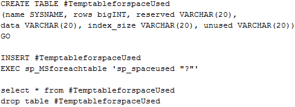

For the past few weeks I have been working on an issue with a vCenter 4.1 database to work properly and to complete stat roll-ups without error. Here are some of the tricks and things that I have found to help identify the problem and possibly fix it for some.  

  
2. Check the HIST\_STAT tables for fragmented indexes and possible performance issues (execute the following in the SQL Management Studio targeting your vCenter database):  
    
    dbcc showcontig (VPX\_HIST\_STAT1)  
    dbcc showcontig (VPX\_HIST\_STAT2)  
    dbcc showcontig (VPX\_HIST\_STAT3)  
    dbcc showcontig (VPX\_HIST\_STAT4)  
    go
    
      
    The results will look like this:  
    
    > DBCC SHOWCONTIG scanning 'VPX\_HIST\_STAT1' table...  
    > Table: 'VPX\_HIST\_STAT1' (882102183); index ID: 1, database ID: 7  
    > TABLE level scan performed.  
    > \- Pages Scanned................................: 534985  
    > \- Extents Scanned..............................: 67439  
    > \- Extent Switches..............................: 311950  
    > \- Avg. Pages per Extent........................: 7.9  
    > \- Scan Density \[Best Count:Actual Count\].......: 21.44% \[66874:311951\]  
    > \- Logical Scan Fragmentation ..................: 53.34%  
    > \- Extent Scan Fragmentation ...................: 11.30%  
    > \- Avg. Bytes Free per Page.....................: 3433.6  
    > \- Avg. Page Density (full).....................: 57.58%
    
      
    The two critical lines are the Scan Density and the Logical Scan Fragmentation (from MSDN):  
    
    > Scan Density  
    >   
    > \[Best Count: Actual Count\] Best count is the ideal number of extent changes if everything is contiguously linked. Actual count is the actual number of extent changes. The number in scan density is 100 if everything is contiguous; if it is less than 100, some fragmentation exists. Scan density is a percentage.
    
      
    
    > Logical Scan Fragmentation Percentage of out-of-order pages returned from scanning the leaf pages of an index. This number is not relevant to heaps and text indexes. An out of order page is one for which the next page indicated in an IAM is a different page than the page pointed to by the next page pointer in the leaf page.
    
      
    If the Scan density is below 50% and/or if the logical scan fragmentation is above 50% then you should complete step 2 to help optimize those tables. (Scan Density will quickly drift in a vCenter installation with more than 50 hosts or 500 VMs)
  
4. If your table indexes are approaching below 50% Scan Density or above 50% Logical Scan Fragmentation, do the following in the SQL Management Studio:  
    
    dbcc dbreindex( 'vpx\_hist\_stat1','pk\_vpx\_hist\_stat1', 70)  
    dbcc dbreindex( 'vpx\_hist\_stat2','pk\_vpx\_hist\_stat2', 70)  
    dbcc dbreindex( 'vpx\_hist\_stat3','pk\_vpx\_hist\_stat3', 70)  
    dbcc dbreindex( 'vpx\_hist\_stat4','pk\_vpx\_hist\_stat4', 70)
    
      
    The above commands will re-index each of the primary indexes on the table. This process may take a few minutes depending on the load on the SQL server, this does lock the index on the table while completing, so do it during a slow time.
  
6. Determining table sizes:In the SQL Management Studio you can execute the following to show exactly what tables are growing larger and possibly causing problems with performance.  
      
      
      
    If your vCenter has been around for a while or just has a lot of use the VPX\_EVENT or VPX\_EVENT\_ARG tables will be large (millions of rows), you can reduce the size of these by setting the 'Database Retention Policy' in vCenter to around 180 days or what your organization feels is needed for accurate logging.  
      
    The tables vpx\_hist\_stat1, and vpx\_hist\_stat2 will contain many, many, many rows; this is where vCenter stores the performance metrics for daily and weekly stats (3 is for monthly and 4 is yearly). If your retention for the daily is above 1 day or your detail setting is set high (3 or higher), you will have more rows than others. These tables operate fine until they reach ~100 million rows (although performance issues can start around 50 million, depending on the SQL server hardware).  
      
    If your vpx\_hist\_stat1 table is approaching 100 million rows or possibly even higher, chances are good that the rollup procedure will start to fail soon, you can reduce this size by reducing the amount of data that is logged. To do this fire up vCenter and set the statistics logging for 'Day' to 3 or lower and retention for 1 day. Then give vCenter a day or two and check again, the table will have shrunk.  
      
    If the stats rollup job is already failing with 'unable to lock row' or other errors you may need to correct the jobs that were installed with vCenter, follow these steps to complete that: [VMware KB100905](http://kb.vmware.com/selfservice/microsites/search.do?language=en_US&cmd=displayKC&externalId=1009857 "VMware KB100905")  
      
    If you are still having issues after completing those steps you can then truncate the tables and get back to a fresh hist\_stat table. To complete this follow these steps: [VMware KB1007453](http://kb.vmware.com/selfservice/microsites/search.do?language=en_US&cmd=displayKC&externalId=100745 "VMware KB1007453") (To avoid losing all the performance stats that have been gathered, just truncate the hist\_stat1 table).
